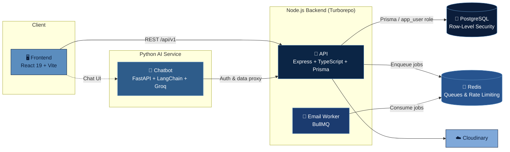

<div align="center">

# 🎓 UniQ

**A full-stack digital services platform for university student affairs — requests, complaints, payments, academic records, and an AI assistant, all in one place.**

[](https://nodejs.org)
[](https://www.typescriptlang.org/)
[](https://react.dev/)
[](https://expressjs.com/)
[](https://www.prisma.io/)
[](https://www.postgresql.org/)
[](https://fastapi.tiangolo.com/)
[](https://turborepo.dev/)
[](https://www.docker.com/)

<sub>Graduation Project · Faculty of Computers and Data Science · Alexandria University</sub>

[Features](#-features) • [Architecture](#-architecture) • [Tech Stack](#-tech-stack) • [Project Structure](#-project-structure) • [Getting Started](#-getting-started) • [API Overview](#-api-overview) • [Chatbot](#-ai-chatbot) • [Database](#-database) • [Docs, Diagrams & Demo](#-docs-diagrams--demo)

</div>

---

## 📖 Overview

**UniQ** is a full-stack platform that digitizes the everyday interactions between university students, academic staff, and the student affairs office. Students can submit requests and complaints, track their academic records, make payments, and get instant help from an Arabic/English AI assistant — while staff and administrators manage everything through dedicated dashboards.

The project is organized as a **Turborepo monorepo** for the Node.js/TypeScript backend, alongside a standalone **React frontend** and a standalone **Python (FastAPI) RAG chatbot microservice**, all orchestrated together with **Docker Compose**.

---

## ✨ Features

| Area | Capabilities |
|---|---|
| 👤 **Authentication & Roles** | JWT-based auth (short & long-lived tokens), role-based access control for `student`, `academic_staff`, `affairs_staff`, and `admin` |
| 📝 **Requests & Complaints** | Students submit requests/complaints with file attachments; staff review, approve, and track status through a full lifecycle |
| 🎓 **Academic Records** | Course history, GPA tracking, semester/program management, doctor approvals |
| 💳 **Payments** | Full payment lifecycle simulation (`initiate` → `confirm`/`fail`) with atomic DB commits and sequential request/payment numbering — no external gateway involved |
| 🔔 **Notifications** | Real-time in-app notifications for students and staff |
| 📧 **Email Delivery** | Background email worker (BullMQ + Redis) for transactional emails, decoupled from the API |
| 🖼️ **File Uploads** | Cloudinary-backed photo/document uploads with signed upload URLs |
| 📊 **Dashboards** | Role-specific dashboards (student, academic staff, affairs office, admin) with charts and analytics |
| 🤖 **AI Chatbot** | Bilingual (Arabic/English) RAG-powered assistant for university bylaws, GPA calculation/planning, and course recommendations |
| 🔒 **Row-Level Security** | PostgreSQL RLS policies enforced via a restricted `app_user` DB role, separate from the migration superuser |

---

## 🏗️ Architecture



**Key design decisions:**
- The **chatbot never talks to the database directly** — every chatbot action (auth, GPA data, chat logging) is proxied through the main API (`/api/v1/chatbot/*`), keeping a single source of truth and a single security boundary.
- The database is accessed through **two Postgres roles**: a superuser (migrations only, via [`entrypoint.sh`](entrypoint.sh)) and a restricted `app_user` role that the running API actually uses, with PostgreSQL **Row-Level Security** policies defined in [`sql/`](sql) and [`packages/database/prisma`](packages/database/prisma).
- Emails are **never sent inline** in a request — they're queued via BullMQ/Redis and processed by the dedicated [`apps/workers`](apps/workers) service, so slow SMTP calls never block API responses.

---

## 🛠️ Tech Stack

<table>
<tr>
<td valign="top" width="33%">

**Frontend**
- React 19 + Vite 7
- React Router 7
- Tailwind CSS 4
- Recharts
- Axios

</td>
<td valign="top" width="33%">

**Backend**
- Node.js 20 + TypeScript
- Express 5
- Prisma 7 (PostgreSQL)
- BullMQ + Redis
- JWT, Helmet, Zod
- Cloudinary, Nodemailer

</td>
<td valign="top" width="33%">

**AI Chatbot**
- Python 3.11 + FastAPI
- LangChain + Groq (Llama 3.3 / 3.1)
- ChromaDB (vector store)
- Sentence-Transformers
- Arabic NLP: AraBERT, PyArabic, Farasa
- Streamlit (standalone demo UI)

</td>
</tr>
</table>

**Infrastructure:** Docker & Docker Compose · Turborepo (npm workspaces) · PostgreSQL · Redis

---

## 📁 Project Structure

Full repository layout (generated files such as `node_modules`, `.git`, and compiled Chroma vector binaries are omitted for clarity):

```
UniQ-Student-Affairs-Platform/
│
├── apps/
│   ├── api/                              # 🚀 Express + TypeScript + Prisma REST API
│   │   ├── src/
│   │   │   ├── controller/                # Request handlers — one per domain
│   │   │   │   ├── academic.controller.ts
│   │   │   │   ├── auth.controller.ts
│   │   │   │   ├── collageInfo.controller.ts
│   │   │   │   ├── complaint.controller.ts
│   │   │   │   ├── inquires.controller.ts
│   │   │   │   ├── notification.controller.ts
│   │   │   │   ├── payment.controller.ts
│   │   │   │   ├── program.controller.ts
│   │   │   │   ├── request.controller.ts
│   │   │   │   ├── staff.controller.ts
│   │   │   │   ├── student.controller.ts
│   │   │   │   └── user.controller.ts
│   │   │   ├── dto/                       # Data-transfer objects, enums & payload shapes
│   │   │   │   ├── INotification.ts
│   │   │   │   ├── ProgramEnum.ts
│   │   │   │   ├── RoleEnum.ts
│   │   │   │   ├── cloudinaryUpload.dto.ts
│   │   │   │   ├── payload.ts
│   │   │   │   ├── response.dto.ts
│   │   │   │   └── user.dto.ts
│   │   │   ├── error/                     # Custom error classes + Express error types
│   │   │   │   ├── AuthenticationError.ts
│   │   │   │   ├── BadRequestError.ts
│   │   │   │   ├── CustomError.ts
│   │   │   │   ├── EntityNotFoundError.ts
│   │   │   │   ├── ForbiddenError.ts
│   │   │   │   ├── NotFound.Error.ts
│   │   │   │   └── types.d.ts
│   │   │   ├── jobs/
│   │   │   │   └── email.job.ts           # Job payload builder enqueued onto BullMQ
│   │   │   ├── lib/
│   │   │   │   └── config.ts              # Centralized env/config loader
│   │   │   ├── middlewares/
│   │   │   │   ├── authenticate-user.ts
│   │   │   │   ├── authorize-permission.ts
│   │   │   │   ├── error-handler.ts
│   │   │   │   ├── file-upload.ts
│   │   │   │   ├── http-logger.ts
│   │   │   │   ├── ip-rate-limiter.ts
│   │   │   │   ├── jwt-rate-limiter.ts
│   │   │   │   ├── optional-auth.ts
│   │   │   │   ├── photo-upload.ts
│   │   │   │   ├── rate-limiter.ts
│   │   │   │   ├── request-context.ts
│   │   │   │   ├── request-logger.ts
│   │   │   │   ├── verify-role.ts
│   │   │   │   └── verify-same-user.ts
│   │   │   ├── queues/
│   │   │   │   └── email.queue.ts         # BullMQ queue definition (producer side)
│   │   │   ├── routes/                    # Route definitions, grouped by domain
│   │   │   │   ├── academic/academic.router.ts
│   │   │   │   ├── authRouter/auth.router.ts
│   │   │   │   ├── chatbot/chatbot.route.ts
│   │   │   │   ├── collageInfoRouter/collageInfo.router.ts
│   │   │   │   ├── complaints/complaints.router.ts
│   │   │   │   ├── inquires/inquires.router.ts
│   │   │   │   ├── notifications/notification.router.ts
│   │   │   │   ├── payments/payment.router.ts
│   │   │   │   ├── program/program.router.ts
│   │   │   │   ├── requests/requests.router.ts
│   │   │   │   ├── staff/staff.router.ts
│   │   │   │   ├── student/student.router.ts
│   │   │   │   ├── user/user.router.ts
│   │   │   │   └── v1/v1.ts               # Mounts every router under /api/v1
│   │   │   ├── services/                  # Business logic, one service per domain
│   │   │   │   ├── academic.service.ts
│   │   │   │   ├── auth.services.ts
│   │   │   │   ├── collage.info.services.ts
│   │   │   │   ├── complaint.service.ts
│   │   │   │   ├── inquires.service.ts
│   │   │   │   ├── notification.service.ts
│   │   │   │   ├── payment.service.ts
│   │   │   │   ├── program.service.ts
│   │   │   │   ├── request.services.ts
│   │   │   │   ├── staff.services.ts
│   │   │   │   ├── student.service.ts
│   │   │   │   └── user.services.ts
│   │   │   ├── templates/email/           # HTML email templates + template-name enum
│   │   │   │   ├── EmailTemplateEnum.ts
│   │   │   │   └── template.ts
│   │   │   ├── tests/
│   │   │   │   └── add.test.ts            # Jest test suite entry point
│   │   │   ├── types/                     # Ambient TypeScript declarations
│   │   │   │   ├── express.d.ts
│   │   │   │   └── geoip-lite.d.ts
│   │   │   ├── utils/                     # Shared helpers (tokens, logging, cache, email…)
│   │   │   │   ├── asyncHandler.ts
│   │   │   │   ├── cache.ts
│   │   │   │   ├── generateToken.ts
│   │   │   │   ├── getAllowedFolder.ts
│   │   │   │   ├── getErrorMessage.ts
│   │   │   │   ├── httpStatus.ts
│   │   │   │   ├── logger.ts
│   │   │   │   ├── safeEmailJob.ts
│   │   │   │   ├── sendEmail.ts
│   │   │   │   └── tokenExpiration.ts
│   │   │   ├── validator/                 # Zod request-validation schemas
│   │   │   │   ├── complaint.schema.ts
│   │   │   │   ├── inquiery.schema.ts
│   │   │   │   ├── request.schema.ts
│   │   │   │   ├── sendEmail.schema.ts
│   │   │   │   └── user.schema.ts
│   │   │   ├── index.ts                   # App bootstrap
│   │   │   └── server.ts                  # HTTP server entry point
│   │   ├── .env.example
│   │   ├── Dockerfile.api
│   │   ├── biome.json                     # Biome lint/format config
│   │   ├── jest.config.mjs
│   │   ├── nodemon.json
│   │   ├── package.json
│   │   └── tsconfig.json
│   │
│   ├── workers/                          # 📧 BullMQ background email worker service
│   │   ├── src/email/
│   │   │   ├── email.processor.js         # Job processing logic (renders + sends email)
│   │   │   ├── email.service.js           # Nodemailer transport wrapper
│   │   │   └── email.worker.js            # Worker entry point (consumes the BullMQ queue)
│   │   ├── .env.example
│   │   ├── Dockerfile.worker
│   │   └── package.json
│   │
│   └── chatbot/                          # 🤖 FastAPI + Streamlit RAG chatbot microservice
│       ├── api/
│       │   └── app.py                     # FastAPI app / HTTP route definitions
│       ├── core/
│       │   ├── access_control.py          # Per-role permission checks for chatbot actions
│       │   ├── memory_manager.py          # Conversation/session memory handling
│       │   └── orchestrator.py            # Central pipeline: intent → RAG → LLM
│       ├── data/                          # Source documents & vector store
│       │   ├── Department/
│       │   │   ├── courses.pdf
│       │   │   └── general_rules.pdf
│       │   ├── chroma_laiha_v2/           # Persisted ChromaDB vector index
│       │   ├── AlexU_*.pdf                # University bylaws source document (Arabic)
│       │   ├── classification_dataset_shuffled.jsonl
│       │   ├── data.json
│       │   └── load_pdfs.py               # Script to ingest/embed PDFs into ChromaDB
│       ├── database/
│       │   └── mock_data.py               # Mock data used for local/offline development
│       ├── services/
│       │   ├── academic_rag_service.py    # RAG specialised for academic bylaws
│       │   ├── gpa_service.py             # GPA calculation & "what-if" planning logic
│       │   ├── intent_service.py          # Classifies user intent per message
│       │   ├── llm_service.py             # Groq/Llama LLM client wrapper
│       │   ├── rag_service.py             # General-purpose retrieval-augmented generation
│       │   └── recommendation_service.py  # Course recommendation logic
│       ├── utils/
│       │   ├── course_matcher.py
│       │   ├── formatters.py
│       │   ├── rate_limiter.py
│       │   └── token_counter.py
│       ├── .env.example
│       ├── Dockerfile
│       ├── app.py                         # Streamlit demo UI entry point
│       ├── config.py                      # Environment/config loader
│       └── requirements.txt
│
├── frontend/                             # 🖥️ React 19 + Vite single-page application
│   ├── public/
│   │   └── vite.svg
│   ├── src/
│   │   ├── Components/                    # Reusable, non-feature-specific UI components
│   │   │   ├── About/                      # About/College landing sections
│   │   │   ├── Card/                       # Program & service cards
│   │   │   ├── Charts/                     # Recharts wrappers (bar, donut, line, stacked)
│   │   │   ├── Chat/                       # Chat widget shell
│   │   │   ├── ContactForm/
│   │   │   ├── Dashboard/                  # Shared dashboard cards/nav/sidebar
│   │   │   ├── Forms/                      # DynamicForm (schema-driven form renderer)
│   │   │   ├── Herosection/
│   │   │   ├── Layouts/                    # DashboardLayout wrapper
│   │   │   ├── Location/
│   │   │   ├── Nav/                        # Navbar, login menu, logo, nav links
│   │   │   ├── Records/                    # Record cards, filters, pagination, modal
│   │   │   ├── Shared/                     # Buttons, avatar, inputs, stats cards, loaders
│   │   │   ├── footer/
│   │   │   ├── GuestRoute.jsx               # Redirects authenticated users away from guest pages
│   │   │   └── ProtectedRoute.jsx           # Route guard for authenticated/role-based pages
│   │   ├── assets/                        # Images grouped by section (About, Hero, Login, Programs…)
│   │   ├── features/                      # Feature-based modules (domain-driven frontend)
│   │   │   ├── academic/pages/             # Academic staff dashboard
│   │   │   ├── admin/                      # Admin service, user cards, admin pages
│   │   │   ├── affairs/                    # Affairs office dashboard, complaints, requests, decisions
│   │   │   ├── auth/                       # Login, forgot/reset password, auth service, role routing
│   │   │   ├── chatbot/                    # Chat widget, GPA calculator/plan forms, chatbot service
│   │   │   ├── dashboard/                  # Shared dashboard data service
│   │   │   ├── notifications/              # Notification context, service & page
│   │   │   └── student/                    # Student dashboard, requests, complaints, payments, records
│   │   ├── pages/                         # Top-level routed pages
│   │   │   ├── Dashboard/RoleDashboard.jsx  # Resolves which dashboard to render by role
│   │   │   ├── Profile/                     # Shared/Staff/Student profile pages
│   │   │   ├── Collage.jsx
│   │   │   ├── CollegeContext.jsx
│   │   │   └── Landing.jsx
│   │   ├── routes/
│   │   │   └── AppRoutes.jsx               # Full role-based route map
│   │   ├── services/                      # Cross-feature API clients
│   │   │   ├── api.js                      # Axios instance (base URL, interceptors)
│   │   │   ├── collegeService.js
│   │   │   ├── contactService.js
│   │   │   └── landingService.js
│   │   ├── store/
│   │   │   └── authContext.jsx             # Global auth context/provider
│   │   ├── App.jsx / App.css
│   │   ├── index.css
│   │   └── main.jsx                        # React app entry point
│   ├── .env.example
│   ├── eslint.config.js
│   ├── index.html
│   ├── package.json
│   ├── tailwind.config.js
│   ├── vite.config.js
│   └── README.md                          # Vite template notes (frontend-specific)
│
├── packages/                             # Shared, workspace-linked libraries
│   ├── database/                          # 🗄️ @repo/db — shared Prisma schema, client & migrations
│   │   ├── prisma/
│   │   │   ├── schema.prisma               # Full data model (users, students, staff, requests…)
│   │   │   └── migrations/                 # Versioned migration history (10 migrations)
│   │   ├── scripts/
│   │   │   └── grant-permissions.ts        # Grants table permissions to the app_user role
│   │   ├── src/
│   │   │   ├── client.ts                   # PrismaClient singleton
│   │   │   └── index.ts
│   │   ├── .env.example
│   │   ├── package.json
│   │   └── prisma.config.ts
│   ├── config/                            # ⚙️ @repo/config — shared runtime configuration
│   │   ├── src/
│   │   │   ├── cloudinary.ts
│   │   │   ├── index.ts
│   │   │   └── redis.ts
│   │   ├── package.json
│   │   └── tsconfig.json
│   ├── ui/                                # 🧩 @repo/ui — shared React UI primitives
│   │   ├── src/
│   │   │   ├── button.tsx
│   │   │   ├── card.tsx
│   │   │   └── code.tsx
│   │   ├── eslint.config.mjs
│   │   ├── package.json
│   │   └── tsconfig.json
│   ├── eslint-config/                     # 🧹 Shared ESLint presets (base, next, react-internal)
│   └── typescript-config/                 # 🧾 Shared tsconfig presets (base, nextjs, react-library)
│
├── sql/                                  # 🐘 Raw SQL: roles, permissions, RLS policies & seed data
│   ├── 01_init_db_user.sql                # Bootstraps DB + restricted app_user role
│   ├── 02_roles_permissions.sql
│   ├── 03_rls_policies.sql                # Row-Level Security policy definitions
│   ├── 04_programs_semesters.sql
│   ├── 05_users_staff_students.sql
│   ├── 06_courses_programs.sql
│   ├── 07_request_types.sql
│   ├── 08_college_info.sql
│   ├── 09_extra_students.sql
│   ├── 10_new_students_programs.sql
│   ├── 11_requests_payments_notifications.sql
│   └── 12_complaints.sql
│
├── http/                                 # 🔬 REST Client (.http) collections for manual API testing
│   ├── academic.http
│   ├── auth.http
│   ├── chatbot_new.http
│   ├── complaints.http
│   ├── landingPage.http
│   ├── payments.http
│   ├── programs.http
│   ├── requests.http
│   ├── staff.http
│   ├── student.http
│   └── user.http
│
├── diagrams/                              # 🗺️ Architecture, flow & UML diagrams
│   ├── Academic RAG Architecture.png
│   ├── Chatbot Architecture.png
│   ├── ERD.png
│   ├── Class Diagram.jpg
│   ├── USE CASE.jpg
│   ├── Data Flow Diagram Level 0.jpg / Level 1.jpg
│   ├── Activity Diagrams*.jpg              # Admin / Academic / Affairs / Visitors flows
│   ├── Sequence Diagram*.jpg                # Student view, merged, chatbot query
│   ├── Logical Schema Diagram QR code.jpg
│   ├── Payment module flow (simulated).jpg
│   └── flow.drawio                          # Editable draw.io source for the diagrams above
│
├── demo/                                  # 🎬 Product walkthrough videos & feature screenshots
│   ├── Platform_demo.mp4
│   ├── chatbot.mp4
│   └── screenshots/                        # Grouped by feature area (Auth, Dashboard, Forms,
│                                            # Chatbot, Notifications, Public pages, Staff, Student…)
│
├── documentation/
│   └── Uniq_documentation.pdf              # Full written project documentation
│
├── presentation/
│   ├── Graduation Project phase 1.pptx
│   └── Graduation project phase 2.pdf
│
├── .env.example                          # Docker Compose env (Postgres + shared HF_TOKEN/APP_USER_PW)
├── .dockerignore / .gitignore / .gitattributes / .npmrc
├── docker-compose.yml                    # Orchestrates api, chatbot, workers, postgres, redis
├── entrypoint.sh                         # API container startup: migrate → grant RLS perms → run
├── package.json                          # Root workspace manifest (npm workspaces: apps/*, packages/*)
├── turbo.json                            # Turborepo pipeline/task configuration
└── README.md
```

<details>
<summary><strong>📂 Quick reference — where things live</strong></summary>

| Path | What lives here |
|---|---|
| [`apps/api/src/routes`](apps/api/src/routes) | All REST route definitions, grouped by domain |
| [`apps/api/src/controller`](apps/api/src/controller) | Request handlers |
| [`apps/api/src/services`](apps/api/src/services) | Business logic, one service per domain |
| [`apps/api/src/middlewares`](apps/api/src/middlewares) | Auth, rate limiting, logging, file upload, error handling |
| [`apps/api/src/validator`](apps/api/src/validator) | Zod request-validation schemas |
| [`apps/api/src/templates/email`](apps/api/src/templates/email) | HTML email templates used by the worker |
| [`apps/workers/src/email`](apps/workers/src/email) | Email queue processor & worker entrypoint |
| [`packages/database/prisma/schema.prisma`](packages/database/prisma/schema.prisma) | Full data model (31 models: users, students, staff, requests, complaints, payments, academic records…) |
| [`packages/database/prisma/migrations`](packages/database/prisma/migrations) | Versioned migration history |
| [`packages/config/src`](packages/config/src) | Shared Redis & Cloudinary configuration |
| [`packages/ui/src`](packages/ui/src) | Shared React UI primitives |
| [`apps/chatbot/services`](apps/chatbot/services) | RAG, intent classification, GPA calculation, course recommendation services |
| [`apps/chatbot/core/orchestrator.py`](apps/chatbot/core/orchestrator.py) | Central pipeline that routes a user message through intent → RAG → LLM |
| [`apps/chatbot/data`](apps/chatbot/data) | Source PDFs + persisted ChromaDB vector store |
| [`frontend/src/features`](frontend/src/features) | Feature-based frontend modules: `auth`, `student`, `academic`, `affairs`, `admin`, `chatbot`, `notifications` |
| [`frontend/src/Components`](frontend/src/Components) | Shared/reusable UI components used across features |
| [`frontend/src/routes/AppRoutes.jsx`](frontend/src/routes/AppRoutes.jsx) | Full role-based route map |
| [`sql/`](sql) | Role bootstrap, permissions & Row-Level Security policies, applied in numeric order |
| [`http/`](http) | REST Client request collections for manual, per-module API testing |
| [`diagrams/`](diagrams) | ERD, class/sequence/activity/use-case diagrams and system architecture visuals |
| [`demo/`](demo) | Demo videos and feature screenshots |
| [`documentation/`](documentation) | Full written project documentation (PDF) |
| [`presentation/`](presentation) | Graduation project presentation slides (phases 1 & 2) |

</details>

---

## 🚀 Getting Started

### Prerequisites

- [Docker](https://www.docker.com/) & Docker Compose
- Node.js ≥ 18 and npm (for local, non-Docker frontend development)
- API keys/credentials for: PostgreSQL, Redis, Cloudinary, Gmail (App Password), Groq, and optionally Hugging Face
- Stripe keys are present in `apps/api/.env.example` as reserved config, but the payment flow currently runs fully simulated — no live Stripe calls are made (see [Payments](#-api-overview))

### 1. Clone & configure environment variables

```bash
git clone https://github.com/<your-org>/uniq.git
cd uniq
```

Each service reads its own `.env` file. Copy every example file and fill in real values — **never commit the resulting `.env` files**:

```bash
cp .env.example .env
cp apps/api/.env.example apps/api/.env
cp apps/workers/.env.example apps/workers/.env
cp packages/database/.env.example packages/database/.env
cp apps/chatbot/.env.example apps/chatbot/.env
cp frontend/.env.example frontend/.env
```

| File | Used by |
|---|---|
| [`.env.example`](.env.example) | Docker Compose (Postgres container + shared `HF_TOKEN`/`APP_USER_PW`) |
| [`apps/api/.env.example`](apps/api/.env.example) | API: JWT secrets, DB, Redis, Cloudinary, email, Stripe |
| [`apps/workers/.env.example`](apps/workers/.env.example) | Email worker: DB, Redis, email credentials |
| [`packages/database/.env.example`](packages/database/.env.example) | Prisma CLI (migrations) |
| [`apps/chatbot/.env.example`](apps/chatbot/.env.example) | Chatbot: Groq API key, backend URLs, CORS |
| [`frontend/.env.example`](frontend/.env.example) | Frontend: API base URL |

### 2. Run everything with Docker Compose

```bash
docker compose up --build
```

This starts, in order: **PostgreSQL**, **Redis**, the **API** (runs Prisma migrations and grants RLS permissions on boot via [`entrypoint.sh`](entrypoint.sh)), the **email worker**, and the **chatbot** service.

| Service | URL |
|---|---|
| API | http://localhost:3000 |
| Chatbot API (FastAPI) | http://localhost:7860 |
| Chatbot demo UI (Streamlit) | http://localhost:8501 |
| PostgreSQL | localhost:5000 |
| Redis | localhost:6379 |

### 3. Run the frontend locally

```bash
cd frontend
npm install
npm run dev
```

The frontend expects the API at `VITE_API_BASE_URL` (see [`frontend/.env.example`](frontend/.env.example)), defaulting to `http://localhost:3000`.

### 4. (Optional) Run the Node backend outside Docker

```bash
npm install          # installs all workspaces (apps/* and packages/*)
npm run dev           # turbo run dev — runs every app in parallel
```

Useful root-level scripts (see [`package.json`](package.json) and [`turbo.json`](turbo.json)):

```bash
npm run build          # turbo run build
npm run lint            # turbo run lint
npm run check-types      # turbo run check-types
npm run format             # prettier --write
```

---

## 🔌 API Overview

All routes are mounted under `/api/v1` — see [`apps/api/src/routes/v1/v1.ts`](apps/api/src/routes/v1/v1.ts).

| Route | Auth | Purpose |
|---|---|---|
| `/auth` | Public | Login, logout, password reset |
| `/programs` | Public | Academic programs listing |
| `/collageInfo` | Public | College/faculty public information |
| `/chatbot` | Public* | Proxy endpoints consumed by the chatbot service |
| `/notifications` | 🔒 | User notifications |
| `/users` | 🔒 | User profile & management |
| `/students` | 🔒 Student | Student-only academic/records endpoints |
| `/complaints` | 🔒 | Complaint submission & review |
| `/requests` | 🔒 | Request submission & review |
| `/academic` | 🔒 | Academic staff endpoints (approvals, records) |
| `/staff` | 🔒 | Staff management |
| `/payments` | 🔒 | Payment processing (Stripe) |

*Chatbot endpoints validate the forwarded user session — see [`chatbot.route.ts`](apps/api/src/routes/chatbot/chatbot.route.ts) for details.

Ready-to-run request collections for every module (auth, students, staff, requests, complaints, payments, academic, programs, landing page) are available in [`http/`](http) — open them with the [REST Client](https://marketplace.visualstudio.com/items?itemName=humao.rest-client) VS Code extension. Sample tokens have been replaced with placeholders — log in via `/api/v1/auth/login` to obtain your own.

---

## 🤖 AI Chatbot

The chatbot ([`apps/chatbot`](apps/chatbot)) is a standalone Python service combining:

- **Intent classification** ([`services/intent_service.py`](apps/chatbot/services/intent_service.py)) to route each message
- **RAG over university bylaws** ([`services/rag_service.py`](apps/chatbot/services/rag_service.py), [`services/academic_rag_service.py`](apps/chatbot/services/academic_rag_service.py)) using ChromaDB + multilingual embeddings, sourced from the PDFs in [`apps/chatbot/data`](apps/chatbot/data)
- **GPA calculation & planning** ([`services/gpa_service.py`](apps/chatbot/services/gpa_service.py))
- **Course recommendations** ([`services/recommendation_service.py`](apps/chatbot/services/recommendation_service.py))
- An **orchestrator** ([`core/orchestrator.py`](apps/chatbot/core/orchestrator.py)) that ties intent → retrieval → LLM (Groq/Llama) generation together, with per-role **access control** ([`core/access_control.py`](apps/chatbot/core/access_control.py))
- A **FastAPI** HTTP layer ([`api/app.py`](apps/chatbot/api/app.py)) exposing the chatbot as a service, plus a lightweight **Streamlit** front door ([`app.py`](apps/chatbot/app.py)) for demoing the assistant independently of the main frontend

The production chat experience is embedded directly into the React app via [`frontend/src/features/chatbot`](frontend/src/features/chatbot); the frontend never calls the chatbot service directly — every request flows through the Node API's `/api/v1/chatbot` routes.

---

## 🗄️ Database

- Schema, relations, and 31 domain models are defined in [`packages/database/prisma/schema.prisma`](packages/database/prisma/schema.prisma)
- Versioned migrations live in [`packages/database/prisma/migrations`](packages/database/prisma/migrations)
- Role/permission bootstrapping and Row-Level Security policies live in [`sql/`](sql), applied in order (`01_init_db_user.sql` → `12_complaints.sql`)
- [`packages/database/scripts/grant-permissions.ts`](packages/database/scripts/grant-permissions.ts) grants table-level permissions to the restricted `app_user` role after migrations run — see [`entrypoint.sh`](entrypoint.sh) for the full boot sequence

---

## 🖼️ Docs, Diagrams & Demo

Supporting project material lives outside the codebase, at the repo root:

- [`diagrams/`](diagrams) — ERD, class diagram, use-case diagram, data-flow diagrams (levels 0 & 1), activity diagrams per role (admin, academic staff, affairs staff, visitors), sequence diagrams (including the chatbot query flow), the simulated payment flow, and the editable `flow.drawio` source
- [`demo/`](demo) — `Platform_demo.mp4` and `chatbot.mp4` walkthroughs, plus categorized screenshots under `demo/screenshots/` (auth & RBAC, dashboards, dynamic forms, notifications, public pages, staff workflows, student workflows, profile management, responsive UI)
- [`documentation/Uniq_documentation.pdf`](documentation/Uniq_documentation.pdf) — full written project documentation
- [`presentation/`](presentation) — graduation project slide decks for phase 1 and phase 2

---

## 🔐 Security Notes

- All secrets are supplied via environment variables — see the `.env.example` files above. **No credentials are committed to this repository.**
- JWTs use separate short-lived and long-lived secrets (`JWT_SECRET_SHORT_LIVE`, `JWT_SECRET_LONG_LIVE`).
- The API runs against Postgres as a **least-privilege `app_user` role**, never the superuser, with Row-Level Security enforced at the database layer.
- Rate limiting is applied both by IP ([`ip-rate-limiter`](apps/api/src/middlewares/ip-rate-limiter.ts)) and by authenticated JWT ([`jwt-rate-limiter`](apps/api/src/middlewares/jwt-rate-limiter.ts)).

---

## 📄 License

No license has been specified yet for this project. Add a `LICENSE` file to define how others may use, modify, and distribute this code.
